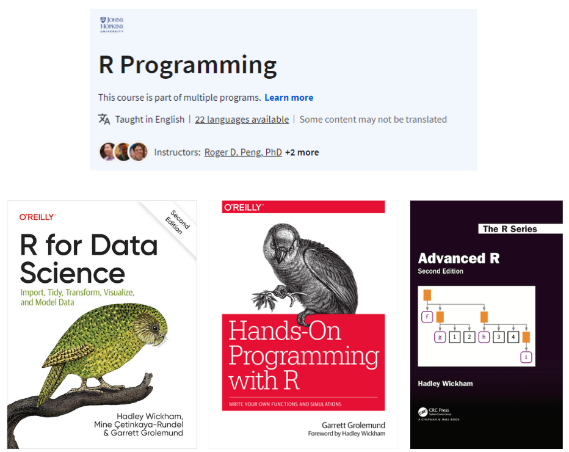

# Gentle Introduction to R Programming Language 

This work, as a whole, is licensed under a <a href="https://creativecommons.org/licenses/by-nc-nd/4.0/?ref=chooser-v1" target="_blank" rel="license noopener noreferrer" style="display:inline-block;"> Creative Commons Attribution-NonCommercial-NoDerivatives 4.0 International License </a>

### Georgia State University
### by [Ozlem Tuncel, PhD](https://ozlemtuncel.github.io/)

# Slides
- **[Introduction to R Programming Language](https://ozlemtuncel.quarto.pub/r-programming-language/)** by Ozlem Tuncel
  - *This slide is based on materials prepared by [Adam Kuczynski](https://adamkucz.github.io/psych548/), [Charles Lanfear](https://clanfear.github.io/) and [Rebecca Ferrell](https://anth.la.psu.edu/people/rebecca-ferrell/). I am indebted to their code, examples, and inspiration.*
- I recommend checking the other website I created for [visualization in R](https://ozlemtuncel.github.io/r_visualization/).

# Hands-on exercise 
- **[Exercise materials](assets/files/R_Exercises.pdf)**
- We are going to use replication materials from:
  - Appell, Benjamin J. and Cyanne E. Loyle. 2012. "The Economic Benefits of Justice: Post-conflict Justice and Foreign Direct Investment". *Journal of Peace Research*. 49(5): 685–99.
- You can use [this link](assets/files/ebj.csv) to download CSV format.
- Or, you can use `stevedata` [package](https://cran.r-project.org/web/packages/stevedata/stevedata.pdf) and load your data with `stevedata::EBJ`

# My go-to sources for learning R

I started learning R around 2015 and over time these four resources was my go-to to learn R. 

- [R Programming Course on Coursera](https://www.coursera.org/learn/r-programming)
- [R for Data Science](https://r4ds.had.co.nz/) by Hadley Wickham, Mine Cetinkaya-Rundel, and Garrett Grolemund
- [Hands-On Programming with R](https://rstudio-education.github.io/hopr/index.html) by Garrett Grolemund
- [Advanced R](https://adv-r.hadley.nz/) by Hadley Wickham

# Very Incomprehensive Sources for Learning R
*If you need more resources on specific things, I have created this incomprehensive list of sources to learn R.*

📦 : R package

⭐: Very Comprehensive Guide (and Ozlem’s Favorite)

🌐: Useful webpage or instruction

📚: Book

### General Resources

- ⭐ 🌐 [Introduction to R Programming Course](https://adamkucz.github.io/psych548/) in University of Washington
- 🌐 [Helpful R Cheat Sheet](https://rpubs.com/alliechoate/504079) by Allie Choate
- ⭐ 📦 [Swirl](https://swirlstats.com/) — Teaches R programming in the R Console
- 📚 [Advanced R](http://adv-r.had.co.nz/) — Hadley Wickham’s book to improve your R programming skills
- ⭐ 🌐 [R Workshop](https://intro2r.library.duke.edu/) by Duke University
- 🌐 [Beginner, Intermediate, and Advanced R Resources](https://education.rstudio.com/learn/) by R Studio
- 🌐 [Learning Statistics with R](https://psyteachr.github.io/) by the psyTeachR team at the University of Glasgow
- 🌐 [How to write nice R code?](https://nicercode.github.io/modules/)
  
### Tables

- 🌐 [How to Make Beautiful Tables in R](https://rfortherestofus.com/2019/11/how-to-make-beautiful-tables-in-r/) — Covers gt, kable + kableExtra + formattable + DT packages
- 📦 [gt](https://gt.rstudio.com/) — good table package
- 📦 🌐 [broom and huxtable](https://www.andrewheiss.com/blog/2018/03/08/amelia-broom-huxtable/)
- 📦 🌐 [stargazer](https://www.jakeruss.com/cheatsheets/stargazer/) — stargazer package
- ⭐ 📦 [sumtable](https://cran.r-project.org/web/packages/vtable/vignettes/sumtable.html) -- sumtable package

### Maps
- 📦 [sf](https://r-spatial.github.io/sf/articles/sf1.html) — Simple Features vignette

### R Markdown

- 🌐 [General Introduction](https://rmarkdown.rstudio.com/lesson-1.html) by R Studio
- 🌐 [Pimp my rmd](https://holtzy.github.io/Pimp-my-rmd/) — Improving your markdown products
- 🌐 [Publishing websites](https://rstudio.github.io/distill/publish_website.html) through R Markdown
- 🌐 [Markdown Cheat Sheet](https://commonmark.org/help/)
- 🌐 [Markdown and YAML cheatsheet](https://learntheweb.courses/topics/markdown-yaml-cheat-sheet/)
- 📚 🌐 [blogdown](https://bookdown.org/yihui/blogdown/)

### Regression Models

- 📦 [tidymodels](https://www.tidymodels.org/) — Consistent framework for your statistical models
- 🌐 [Robust and clustered standard errors with R](https://evalf21.classes.andrewheiss.com/example/standard-errors/)

### Quarto

- ⭐ 🌐 [Getting Started with Quarto Presentations](https://rstudio-conf-2022.github.io/get-started-quarto/materials/05-presentations.html#/presentations)
- 🌐 [Creating presentations with quarto](https://quarto.org/docs/presentations/revealjs/)
- ⭐ 🌐 [A curated list of Quarto resources](https://github.com/mcanouil/awesome-quarto)
- 🌐 [Quarto guide](https://www.apreshill.com/blog/2022-04-we-dont-talk-about-quarto/) by Allison Hill
- 🌐 [A Quarto tip a day](https://mine-cetinkaya-rundel.github.io/quarto-tip-a-day/)
- 🌐 [Reveal.js to make slides with Quarto](https://meghan.rbind.io/blog/2022-07-12-making-slides-in-quarto-with-revealjs/)

### Web Scraping

- 🌐 [Web Scraping course by DataCamp](https://www.datacamp.com/courses/web-scraping-in-r)
- 📦 [rvest](https://dcl-wrangle.stanford.edu/rvest.html) — scrape information from a webpage
    - 📦 [rvest vignette](https://cran.r-project.org/web/packages/rvest/vignettes/rvest.html)
- 🌐 [Scraping with R](https://www.scrapingbee.com/blog/web-scraping-r/)
- ⭐ 🌐 [Scraping with RSelenium](https://burtmonroe.github.io/TextAsDataCourse/Tutorials/TADA-RSelenium.nb.html)

### Text Analysis

- 🌐 [Topic Modelling in R](https://www.tidytextmining.com/topicmodeling.html)
- 🌐 [Basic text analysis in R](https://cbail.github.io/SICSS_Basic_Text_Analysis.html)
- 🌐 [Regular expressions](https://jfjelstul.github.io/regular-expressions-tutorial/)
- 🌐 [Scaling with Word Fish approach](https://burtmonroe.github.io/TextAsDataCourse/Tutorials/IntroductionToWordfish.nb.html)
- 📦 [quenteda](https://tutorials.quanteda.io/) — Package information and tutorials
- 📦 [textreuse](https://docs.ropensci.org/textreuse/) — Text reuse approach package
- 📦 [tm](https://cran.r-project.org/web/packages/tm/vignettes/tm.pdf) — Text mining package
- 🌐 [Quantitative Text Analysis Using R and quanteda](https://www.uni-muenster.de/imperia/md/content/ifpol/grasp/2019-06-27_muenster.pdf) by Kenneth Benoit
- ⭐ 🌐 [regex](https://regex101.com/) practice website
- 🌐 [Introduction to regex](https://www.oreilly.com/content/an-introduction-to-regular-expressions/) by O’Reilly
- 🌐 [Text analysis using R](https://guides.library.upenn.edu/penntdm/r)

### GitHub and Git in R

- 🌐 [R Packages chapter directions on Git use](https://r-pkgs.org/software-development-practices.html) by O'Reilly

### Shiny R
- 🌐 [Creating web applications with Shiny R](https://pdhp.isr.umich.edu/workshops/creating-web-applications-with-r-shiny/)
  
### Miscellaneous but very useful

- 🌐 [Package downloads over time](https://dgrtwo.shinyapps.io/cranview/) — Useful when it is hard to decide which package to use
- 🌐 [Creating websites in R](https://www.emilyzabor.com/tutorials/rmarkdown_websites_tutorial.html) — A tutorial by Emily Zabor using R Markdown and GitHub Pages
- ⭐ 🌐 [Happy Git and GitHub for UseR](https://happygitwithr.com/) — Comprehensive guide on how to use GitHub with R
- 📦 [stm](https://www.structuraltopicmodel.com/) — Structural Topic Modelling package
- 📚 [Text Mining with R](https://www.tidytextmining.com/index.html)
- 🌐 [Outlines in R Studio](https://www.natedayta.com/2019/12/25/owning-outlines-in-rstudio/)
- 📦 [margins](https://cran.r-project.org/web/packages/margins/vignettes/Introduction.html#Interpreting_Interactions_with_Marginal_Effects) — margins package copying functionality of Stata margins
- 📦 [predtools](https://cran.r-project.org/web/packages/predtools/vignettes/calibPlot.html) — Calibration Plot
- 📦 [ggsankey](https://r-charts.com/flow/sankey-diagram-ggplot2/) — Sankey diagram using ggplot2 features
- 🌐 [Detailed ggsankey vignette](https://rpubs.com/techanswers88/sankey-with-own-data-in-ggplot)
- 🌐 [Translating Stata to R](https://stata2r.github.io/)
- ⭐ 🌐 [An introduction to Python for R Users](https://rebeccabarter.com/blog/2023-09-11-from_r_to_python)
- 📦 [sampleSelection package](https://cran.r-project.org/web/packages/sampleSelection/vignettes/selection.pdf)
- ⭐ 🌐 [InteractionPoweR Shiny App for analytic power](https://david-baranger.shinyapps.io/InteractionPoweR_analytic/)
- 📦 [did package](https://bcallaway11.github.io/did/articles/did-basics.html) -- Difference-in-Differences design package
- 🌐 [Top R packages for political science and economics dataset](https://rforpoliticalscience.com/2023/04/07/top-r-packages-for-downloading-political-science-and-economics-datasets/#rpackage)
